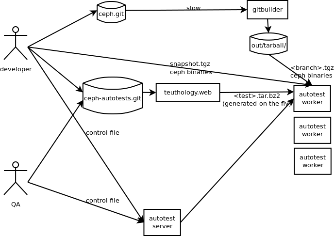

================
 Ceph autotests
================

The Ceph project needs automated tests. Because Ceph is a highly
distributed system, and has active kernel development, its testing
requirements are quite different from e.g. typical LAMP web
applications. The best of breed free software test framework that
covers our needs seems to be Autotest.

However, Autotest was created for a very specific use, and while it is
being made more flexible, it still has a lot of assumptions.  To fit
Ceph needs into Autotest thinking, we've created a bit of a special
setup:

   .. if you're reading the raw file, look at the file overview.png manually

   .. or update it with
   .. dia -e overview.png -t cairo-alpha-png overview.dia

   Ceph's autotests are stored in ``ceph-autotests.git``. They are
   served as on-demand generated ``.tar.bz2`` by a web service called
   ``teuthology.web``. This is called "external tests" by
   Autotest.

   To make tests run faster, they work by using pre-compiled binaries;
   these are provided either by gitbuilder (using the same web server
   as the status web page), or developers wishing to test their own
   changes (any HTTP URL will work).

   ``control`` files are short Python snippets that tell Autotest how
   to perform a particular test run. They can be entered in a web form,
   or passed to a command-line client ``atest``.

Running the tests
=================

Log in to the Autotest web UI, currently at the ugly URL of
http://10.3.14.52/ . The username and password are separate from any
other, and maintained in Autotest's MySQL database. For now, talk to
tommi.virtanen@dreamhost.com.

From there, you can click *Create Job*, and

* enter a *Job name*
* choose machines to run it on; you should use *Specify host labels*
  to list the type(s) of machine(s) your test needs
* click "Edit control file" and type the top-level control logic of
  your test there.

Control files
-------------

Control files are snippets of Python that tell Autotest how to run the tests.

In a multi-machine *server test*, the control file would be what
coordinates the test across machines. For now, let's concentrate on
single-machine *client tests*. Here's an example::

  job.cache = False
  job.run_test('http://ceph.newdream.net:8116/tarball/master/cfuse_simple.tar.bz2')

``job.cache = False`` tells Autoserv that the ``run_test`` parameter
URL is likely to change, and it should never use a cached tarball.

The ``run_test`` function makes Autotest download the test definition
from the given URL. They are served via ``teuthology.web``, from the
files in the ``tests/`` directory of the source tree. We'll talk about
test structure later.

While developing tests, you can keep amending/rebasing them, and just
push them to your own branch of ``ceph-autotests.git`` (to overwrite
the branch, use ``git push origin +MYBRANCHNAME``), and just replace
*master* in the URL above with your branch name. Using Git SHA1s
directly is also possible. Please do not push tests to master until
they succeed reliably.

Binary tarballs
===============

To avoid recompiling Ceph on every test run (and on every machine, for
multi-machine tests), we use precompiled tarballs that contain the
output of "make install".

Gitbuilders will create these after a successful run, and serve them
at e.g. http://ceph.newdream.net/gitbuilder/tarball/ or more specifically e.g.
http://ceph.newdream.net/gitbuilder/tarball/ref/origin_master.tgz .

Note: do not trust the links on those HTML pages, they are confused by
an Apache ProxyPass directive (TODO).

Tests will default to using the latest successful automatic build of
``master``. You can override this by passing the ``ceph_binary_url``
keyword argument in the control file::

  job.cache = False
  job.run_test(
      url='http://ceph.newdream.net:8116/tarball/master/cfuse_simple.tar.bz2',
      ceph_bin_url='http://something.example.com/me/mytar.tgz',
      )

(TODO that is not implemented yet!)

Do not use IP addresses in the URL! Autotest reuses the URL as a
Python package name, and leading numbers will break that
mechanism. For machines at the office, use
e.g. http://ip-10-0-1-42.dreamhost.com:8080/something

Adding a test
=============

A test is a subdirectory of ``tests/`` in the ``ceph-autotests.git``
repository. A test named ``foobar`` **must** have a file named
``foobar.py``, with a class named ``foobar``::

  from autotest_lib.client.bin import test

  from teuthology import ceph

  class cfuse_simple(test.test):
      ...

The best way to learn it is probably looking at the existing tests.
The relevant Autotest wiki pages are:

 - http://autotest.kernel.org/wiki/AutotestApi
 - http://autotest.kernel.org/wiki/AddingTest

Teuthology, a library for common test tasks
===========================================

Most Ceph autotests are expected to perform fairly similar
setup/teardown tasks. These are abstracted into the ``teuthology``
Python library, which is bundled in the test ``.tar.bz2`` by
``teuthology.web``.

Documentation for the library is in its source, as Python
docstrings. See the subdirectory ``teuthology`` for more.

A typical use will look something like this::

  from autotest_lib.client.bin import test

  from teuthology import ceph

  class cfuse_simple(test.test):
    ...
    def run_once(self):
        ...
        ceph.wait_until_healthy(self)
            ...

Using worker machines manually
==============================

You can use the autotest worker machines for manual testing, by
*locking* them in the web user interface, or on the command line with
``atest host mod --lock``. Remember to unlock them when done.

(TODO the command line client doesn't work right yet, use the web UI.)

Multi-machine tests
===================

TODO
